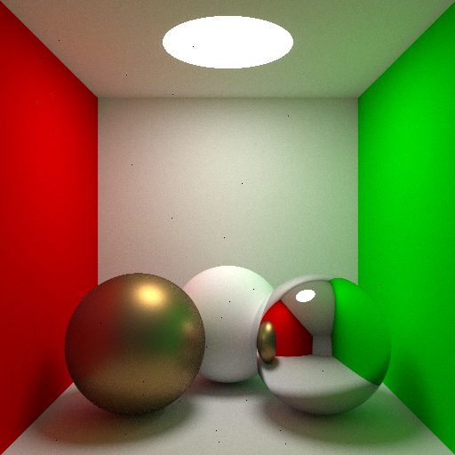
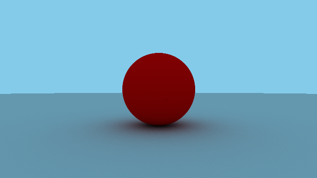
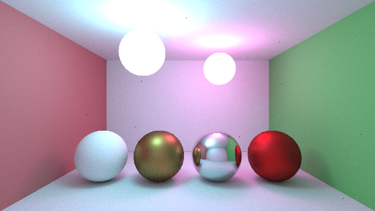

# Monte Carlo Path Tracing in Rust

`cargo run --release .\scenes\cornell_box.json 512 512 16384 5  `

`cargo run --release -- scenes/minimal.json 640 360 1024 5`

`cargo run --release -- scenes/box.json 640 360 8192 5`

## Links

-   https://www.scratchapixel.com/lessons/3d-basic-rendering/global-illumination-path-tracing/introduction-global-illumination-path-tracing.html
-   https://www.cg.tuwien.ac.at/sites/default/files/course/4411/attachments/04_path_tracing_0.pdf
-   https://boksajak.github.io/files/CrashCourseBRDF.pdf
-   https://www.pbr-book.org/
-   https://typhomnt.github.io/teaching/ray_tracing/pbr_intro/
-   https://nickymeuleman.netlify.app/blog/multithreading-rust
-   https://computergraphics.stackexchange.com/questions/4979/what-is-importance-sampling
-   https://computergraphics.stackexchange.com/questions/4394/path-tracing-the-cook-torrance-brdf
